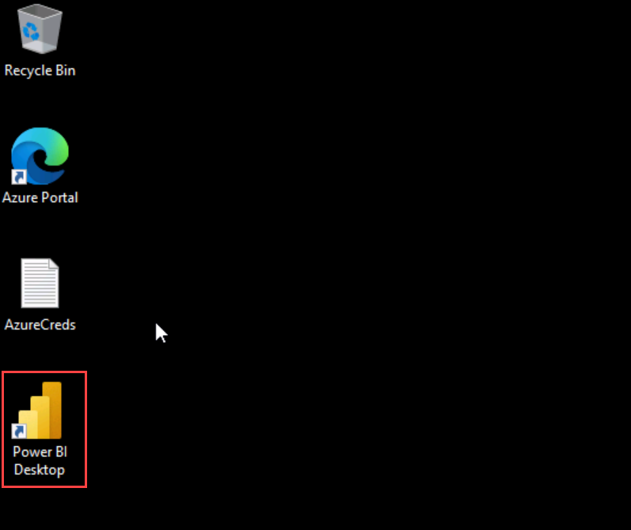

# Risk-Classification-and-Loan-Modeling

# Risk Classification and Loan Modeling

The objective of the Risk Classification with Loan Modeling accelerator is to predict how much loan amount will be approved by the SBA & their registered lenders when a business applies for a loan through the SBA. 
  
The Small Business Administration (SBA) was founded in 1953 to assist small businesses and entrepreneurs in obtaining loans. Small businesses have been the primary source of employment in the United States-helping with job creation which reduces unemployment. Small business growth also promotes economic growth. One of the ways the SBA helps small businesses is by guaranteeing bank loans. This guarantee reduces the risk to banks and encourages them to lend to small businesses. If the loan defaults, the SBA covers the amount guaranteed, and the bank suffers a loss for the remaining balance.

## Exercise 1 : View the PowerBI report Dashboard

1. In the Desktop click on the **Power BI Desktop** icon.
    
