# Risk-Classification-and-Loan-Modeling

# Risk Classification and Loan Modeling

The objective of the Risk Classification with Loan Modeling accelerator is to predict how much loan amount will be approved by the SBA & their registered lenders when a business applies for a loan through the SBA. 
  
The Small Business Administration (SBA) was founded in 1953 to assist small businesses and entrepreneurs in obtaining loans. Small businesses have been the primary source of employment in the United States-helping with job creation which reduces unemployment. Small business growth also promotes economic growth. One of the ways the SBA helps small businesses is by guaranteeing bank loans. This guarantee reduces the risk to banks and encourages them to lend to small businesses. If the loan defaults, the SBA covers the amount guaranteed, and the bank suffers a loss for the remaining balance.

## Exercise 1 : View the PowerBI report Dashboard

1. In the Desktop click on the **Power BI Desktop** icon.

      
    
2. Click on the **X** symbol to close Get Started page.

    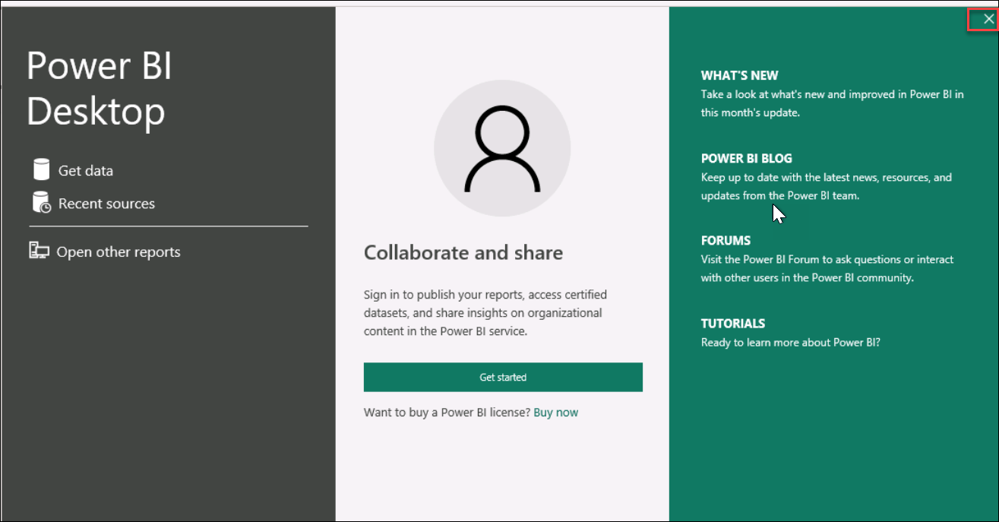  
    
3. Click on the File option.

    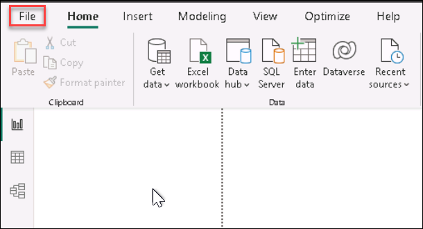
    
4. In the **Open reports(1)** section click on the **Browse report(2)**.

    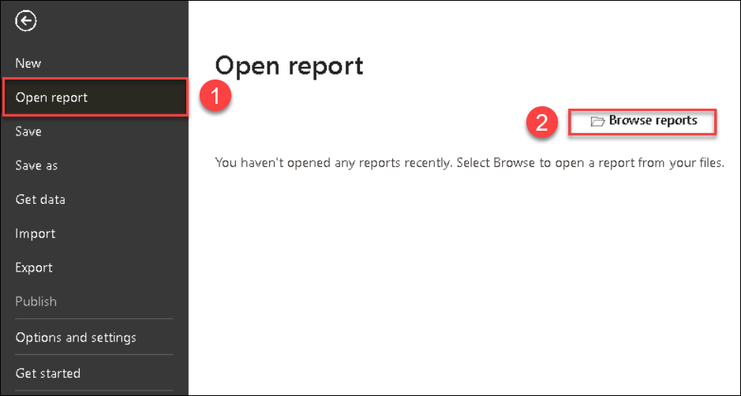  
    
5. Move to the location **C:\LabFiles(2)** , select the **RCLM-file(3)** and click **Open(4)**.

    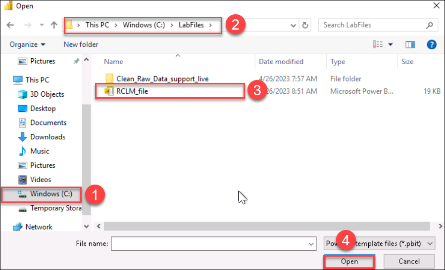
 
 6. On **RCLM_file** tab click on **Load**.

    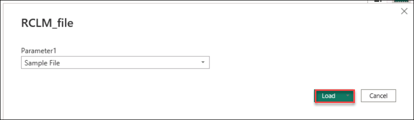
    
7. On **Refresh** Page click on **Close**.
  
    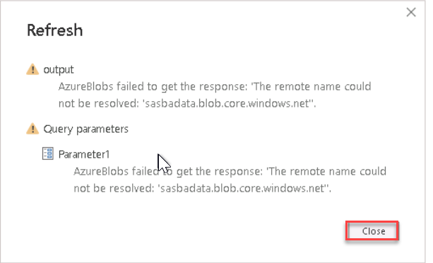
    
8. Click on **Down Arrow in the Transform Data(1)** and select **Data Source Setting(2)**

    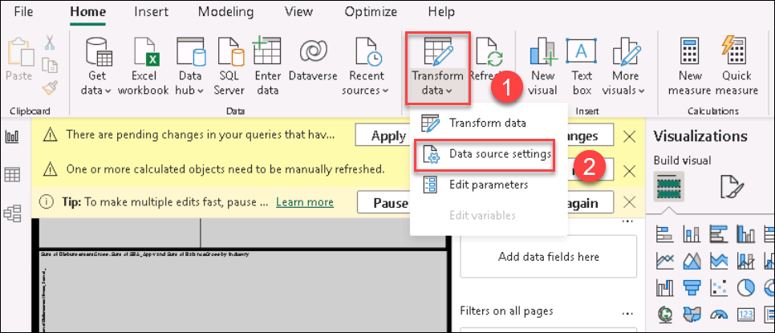
    
9. Click on **Change Source** on Data Source Setting page.

    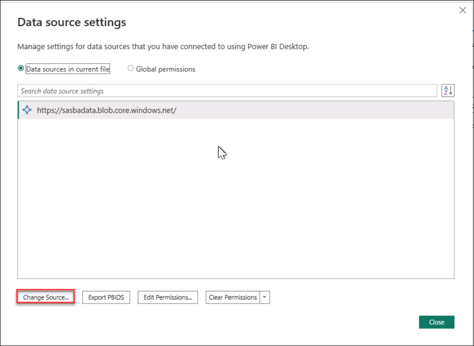

10. Type **sbadataDID(1)** and click **Ok(2)**.
     **Note**: Replace **DID** by the **Deployment ID** provided in the environment details

     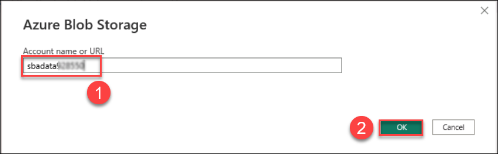

     **Note**: If the Account key is popup for the Authentication go to the Azure portal to the **sbadataDID** storage account and in the **Access keys** section select **key1**.
     
     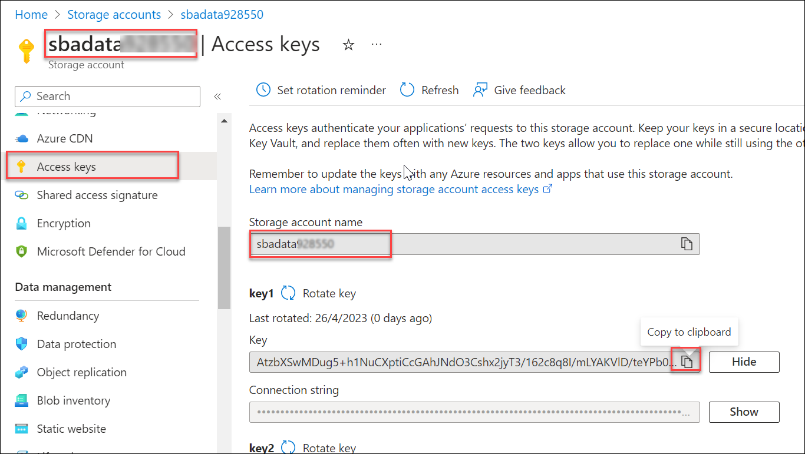

11. click **Close**.

    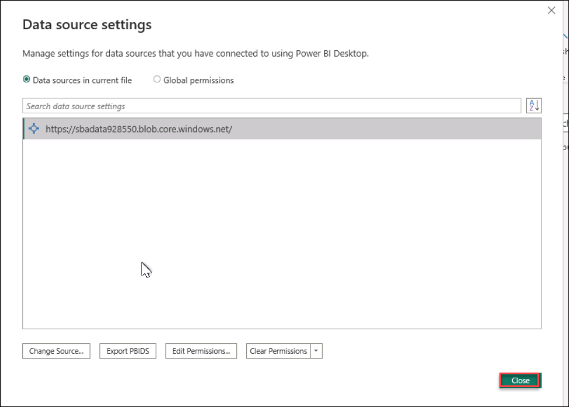
    
12. Click on **Apply Changes** wait untill the load is **complete** and click on close.

      **Note**: Ignore if there is any errors

     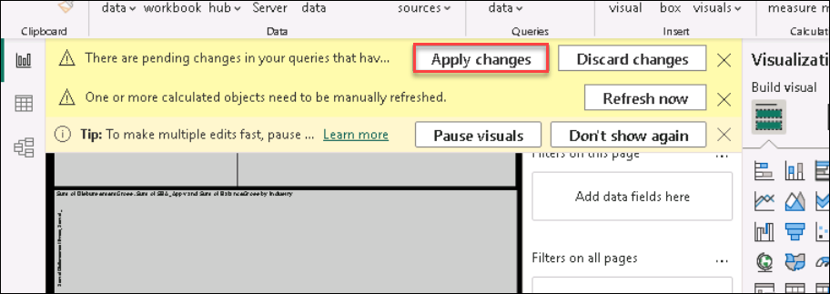
    
13. Review the Dashboard.

     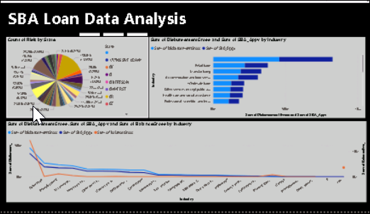
