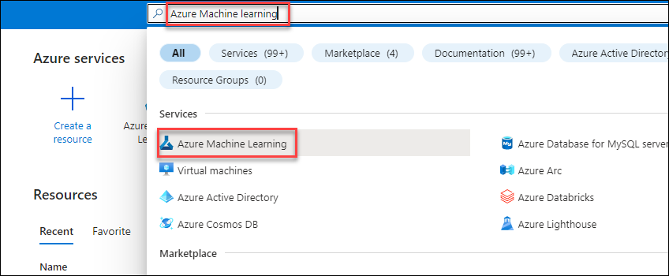

# Risk-Classification-and-Loan-Modeling

# Risk Classification and Loan Modeling

The objective of the Risk Classification with Loan Modeling accelerator is to predict how much loan amount will be approved by the SBA & their registered lenders when a business applies for a loan through the SBA. 
  
The Small Business Administration (SBA) was founded in 1953 to assist small businesses and entrepreneurs in obtaining loans. Small businesses have been the primary source of employment in the United States-helping with job creation which reduces unemployment. Small business growth also promotes economic growth. One of the ways the SBA helps small businesses is by guaranteeing bank loans. This guarantee reduces the risk to banks and encourages them to lend to small businesses. If the loan defaults, the SBA covers the amount guaranteed, and the bank suffers a loss for the remaining balance.

## Exercise 1 : View the PowerBI report Dashboard

1. In the Desktop click on the **Power BI Desktop** icon.

      
    
2. Click on the **X** symbol to close Get Started page.

      
    
3. Click on the File option.

    
    
4. In the **Open reports(1)** section click on the **Browse report(2)**.

      
    
5. Move to the location **C:\LabFiles(2)** , select the **RCLM-file(3)** and click **Open(4)**.

    
 
 6. On **RCLM_file** tab click on **Load**.

    
    
7. On **Refresh** Page click on **Close**.
  
    
    
8. Click on **Down Arrow in the Transform Data(1)** and select **Data Source Setting(2)**

    
    
9. Click on **Change Source** on Data Source Setting page.

    

10. Type **sbadataDID(1)** and click **Ok(2)**.

     **Note**: Replace **DID** by the **Deployment ID** provided in the environment details

     

     **Note**: If the Account key is popup for the Authentication go to the Azure portal to the **sbadataDID** storage account and in the **Access keys** section select **key1**.
     
     

11. click **Close**.

    
    
12. Click on **Apply Changes** wait untill the load is **complete** and click on close.

      **Note**: Ignore if there is any errors

     
    
13. Review the Dashboard.

     

## Exercise 2 : Running the machine learning pipelines

1. Go to the Azure Portal and search for the **Azure Machine Learning** and select it.
 
    

2. Select the **loanmodelDID** in the under Azure Machine Learning.

    

3. Click on the **Launch Studio**

     

4. In the Azure Machine Learning Studio, click on the **Designer(1)** and Click on **Create the pipline using classic pre-built modules(2)**.

     

5. In the designer page click on the **settings**.
    
    

6. For **Select Compute type**: **Container Instance(1)**, for **Select Azure ML compute instance** : **loanmodel(2)** and click on **Save(3)**.

    
    
7. Under the **Data** Section Drag and Drop **SBADATA** to the worspace.

    

8. Under the **Component** Section Search for **Select Columns in Dataset** and Drag and Drop at Workspace region.

    

9. Connect **SBADATA(1)** output to input of **Select Columns in Dataset(2)**.

    

10. Double click on the **Select Columns in Dataset** icon then under select columns click on **edit columns**.

     

11. Enter all the below coloumn names and click on **save**.
 (City,State,Bank,BankState,Term,NoEmp,NewExist,CreateJob,RetainedJob,FranchiseCode,UrbanRural,RevLineCr,LowDoc,DisbursementGross,GrAppv,SBA_Appv,IndustryCode,Risk)

     

12. Under the **Component** section search **Clean Missing Data** and Drag and Drop at the workspace region.

     

13. Connect **select Columns in Dataset(1)** output to input of **Clean Missing Data(2)**.

     

14. Double click on the **Clean Missing Data** icon then under select columns click on **edit columns**.

     

15. Under **cloumns to be cleaned** page for **Include** selct **All Columns**.

     

16. Click on **Save**.

     

17. Select the **Remove entire row** for **Cleaning mode**.

     

18. Under the **Component** section search **Split Data** and Drag and Drop at the workspace region.

     

19. Connect **Clean Missing Data(1)** left output to input of **Split Data(2)**.

     

20. Double click on the **Split Data** icon for **Fraction of rows in the first output dataset** change the value to **0.7**.

     

21. Under the **Component** section search **Multiclass logistic Regression** and Drag and Drop at the workspace region.

     

22. Under the **Component** section search **Train Model** and Drag and Drop at the workspace region.

     

23. Connect output of the **Multiclass logistic Regression(1)** to the left input of **Train Model(2)** and left output of the **Split Data(3)** to **Train Model(4)**

     

24. Double click on the **Train Model** icon then under Label columns click on **edit column**

     

25. Under the **Label Column** select **column names** and type **Risk** and click on **Save**.

     

26. Under the **Component** section search **Score Model** and Drag and Drop at the workspace region.

     

27. Connect output of the **Train Model(1)** to the left input of **Score Model(2)** and Right output of the **Split Data(3)** to **score Model(4)**

     

28. Under the **Component** section search **Evaluate Model** and Drag and Drop at the workspace region.

     

29. Connect **Score Model(1)** left output to input of **Evaluate Model(2)**.

     

30. Click on **Submit**.

     

31. On **Setup Pipeline job** page select **Create new**, **New Experiment Name** : **SBA_Loan_Risk_Prediction** and click on **Submit**.

      

32. Wait untill the Pipline run is completed.

     

